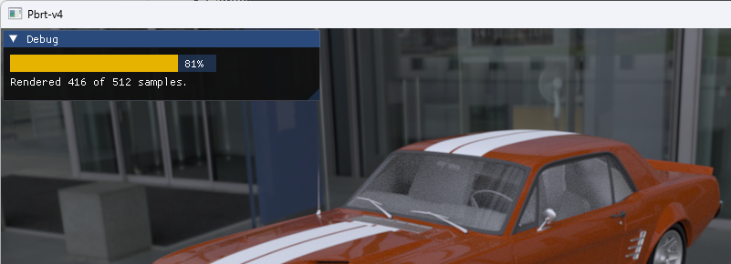
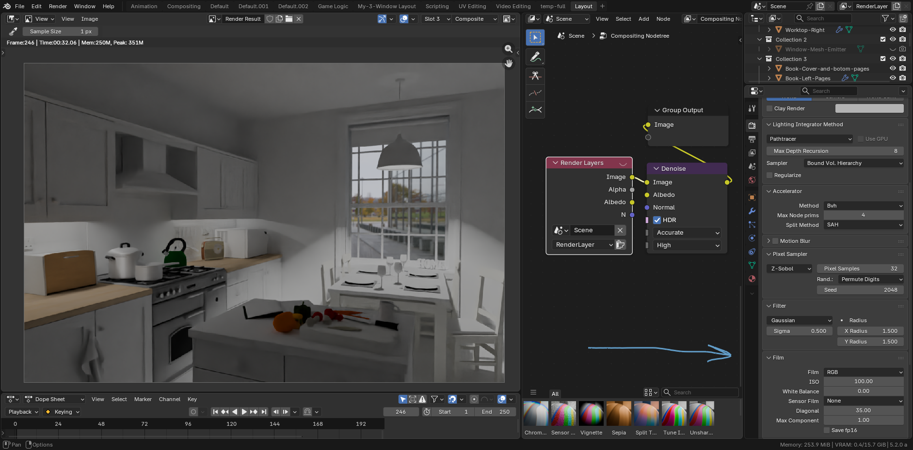

### Why this fork..??

I have a few personal reasons to created this fork..

I"ve always wanted to learn the techniques of rendering, since the first time I saw a Pov-Ray 2.0 render.
That scene that was slowly drawn, line by line, on the screen of an old 386 sx,
until it completed an image of a checkered plane, on which rested a red, bright and perfect sphere.
Thus, this project is just an excuse to continue learning in the best possible way: by practicing.

### Blender integration state

I'm adding documentation about the current state of the Blender implementation in the [wiki](https://github.com/pbrt4bounty/pbrt-v4/wiki) section, with some screenshots and examples.

### Changes on this fork/branch

This branch include some experimental additions:

From other forks:
  - Intel Open Path Guiding implementation from https://github.com/OpenPathGuidingLibrary/pbrt-v4
  - Volume Scattering Probability Guiding implementation from: https://github.com/kehanxuuu/vspg-pbrt-v4
    - [OpenPGL & VSPG current state](https://github.com/pbrt4bounty/pbrt-v4/wiki/Open-Path-Guiding)   
  - a few experimental implementations from: https://github.com/rOnInRaJ-dev/pbrt-v4.git
    - [x] Procedural Mesh [commit](https://github.com/pbrt4bounty/pbrt-v4/commit/9adac4a0300e91ace2095288e015ae6071749645)
    - [ ] God rays
    - [ ] Bilateral filter(for SPPM..?)
  - Camera shift and tilt(searching the fork link..)

My small contributions..
  - Added Progresbar for interactive mode using [ImGui](https://github.com/ocornut/imgui) 

  - Added the ability to set the different EXR channels defined in the GBuffer as user defined AOVS.

    The way to define which AOV's we want to generate is to add an array of integers, from 0 to 9 ``` "integer aovs' [ 0 1 2 3 ...]" ```
    where each number corresponds to a certain [pass](https://github.com/pbrt4bounty/pbrt-v4/blob/pbrt4blender/src/pbrt/film.cpp#L803).
    By default, the AOV main, (0) is always created even if it is not included in the array. Because this branch is intended to be used in Blender,
    we changed the name of the AOV 'main' to 'Combined' and defined with RGBA channels, to avoid a Blender warning, when the image is loaded into the internal buffer.
    This is the implementation into Blender 
    
  - Added support to use the binary hair definition files from Cem Yuksel format( only for CPU..) https://github.com/cemyuksel/cyCodeBase.

  - Extended the previously added support to [GuidedBufferFilm](https://github.com/pbrt4bounty/pbrt-v4/commit/b067593d49f473020c7152361bc789b2d18c447a) for AOV's, also to [RGBFilm](https://github.com/pbrt4bounty/pbrt-v4/commit/0a33de4b337fdb71f49a776e6e6ebbc31180139c), intended to improve the denoising results.

    | Only 'Beauty'                            | With 'Albedo' and 'Normal'                       |
    | ---------------------------------------- | ------------------------------------------------ |
    |  |  |

    

  - (w.i.p)

