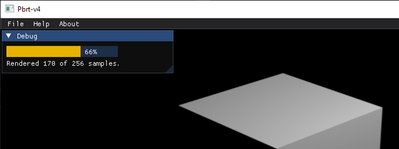

### Why this fork..??

I have a few personal reasons to created this fork..

I"ve always wanted to learn the techniques of rendering, since the first time I saw a Pov-Ray 2.0 render.
That scene that was slowly drawn, line by line, on the screen of an old 386 sx,
until it completed an image of a checkered plane, on which rested a red, bright and perfect sphere.
Thus, this project is just an excuse to continue learning in the best possible way: by practicing.

### Changes on this fork/branch

This branch include some experimental additions:

From other forks:
  - Intel OpenPGL implementation from https://github.com/OpenPathGuidingLibrary/pbrt-v4
  - VSPG implementation, based on OpenPGL from: https://github.com/kehanxuuu/vspg-pbrt-v4
  - a few experimental implementations from: https://github.com/rOnInRaJ-dev/pbrt-v4.git
    - [x] Procedural Mesh [commit](https://github.com/pbrt4bounty/pbrt-v4/commit/9adac4a0300e91ace2095288e015ae6071749645)
    - [ ] God rays
    - [ ] Bilateral filter(for SPPM..?)
  - Camera shift and tilt(searching the fork link..)

My small contributions..
  - Added Progresbar for interactive mode using [ImGui](https://github.com/ocornut/imgui) 
  - Added the ability to set the different EXR channels defined in the GBuffer as user defined AOVS.
  - Added support to use the binary hair definition files from Cem Yuksel format( only for CPU..) https://github.com/cemyuksel/cyCodeBase
  - (w.i.p)
